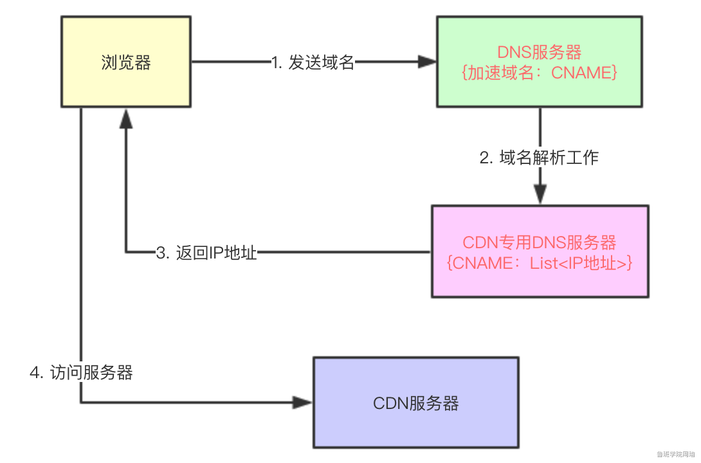

CDN（其实就是提高访问速度）

CDN全称叫做“Content Delivery Network”，中文叫**内容分发网络**。

DNS负责域名解析：解析成IP地址或者是别名（CNAME）

CNAME实际上是一个代理的角色

DNS解析出别名会根据别名在解析出IP地址，在将IP地址返回给浏览器

服务器资源分为动态资源（设计数据库）和静态资源（速度快）

CDN有自己专门的DNS服务器

用户使用某个域名来访问静态资源时（这个域名在阿里CDN服务中叫做“加速域名”），比如这个域名为“image.baidu.com”，它对应一个CNAME，叫做“cdn.ali.com”，那么普通DNS服务器（区别**CDN专用DNS服务器**）在解析“image.baidu.com”时，会先解析成“cdn.ali.com”，普通DNS服务器发现该域名对应的也是一个DNS服务器，那么会将域名解析工作转交给该DNS服务器，该DNS服务器就是**CDN专用DNS服务器。****CDN专用DNS服务器**对“cdn.ali.com”进行解析，然后依据服务器上记录的所有CDN服务器地址信息，选出一个离用户最近的一个CDN服务器地址，并返回给用户，用户即可访问离自己最近的一台CDN服务器了。

在对域名解析时有多种类型的记录，最常用的比如：

- A记录：一个域名对应一个IP地址
- CNAME：一个域名对应另外一个域名
- NS：将子域名指定其他DNS服务器解析

参考链接：https://www.yuque.com/books/share/464efc50-69fe-4c97-ac20-c6a661cccb49/ovr06k