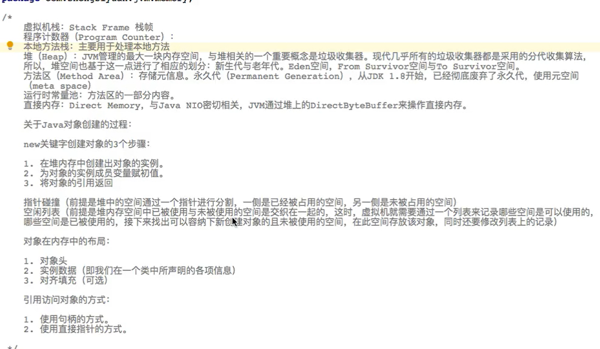
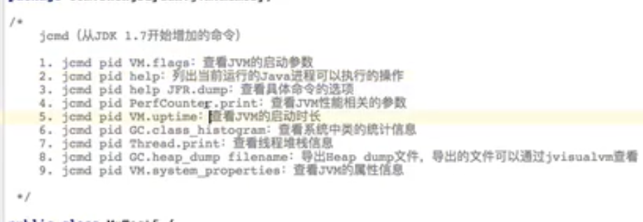
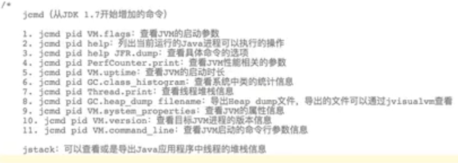
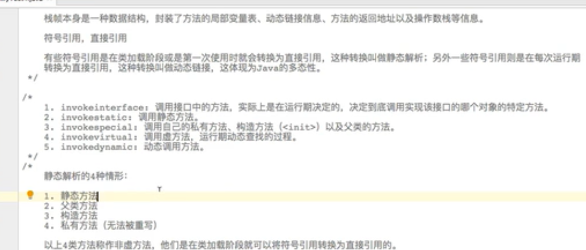
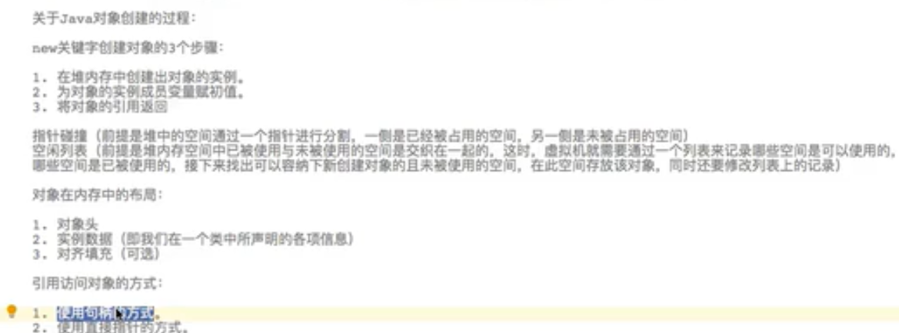

jmap -heap pid可以查看应用程序堆的信息

ps -ef|grep java  可以查到含有与Java相关进程的pid

jstat可以打印元空间信息

MC :分配到元空间大小

 MU:已使用的元空间大小    元空间是可以自己扩容的

元空间：产生新的类信息或导致元空间扩容，变大

jps当前操作系统运行的Java进程

jcmd -l展示JVM进程

查看jvm启动参数

jcmd pid VM.flags查看jvm启动参数配置

dump文件可以用jvisualVm装入，打开

jhat 可以分析堆转储文件

