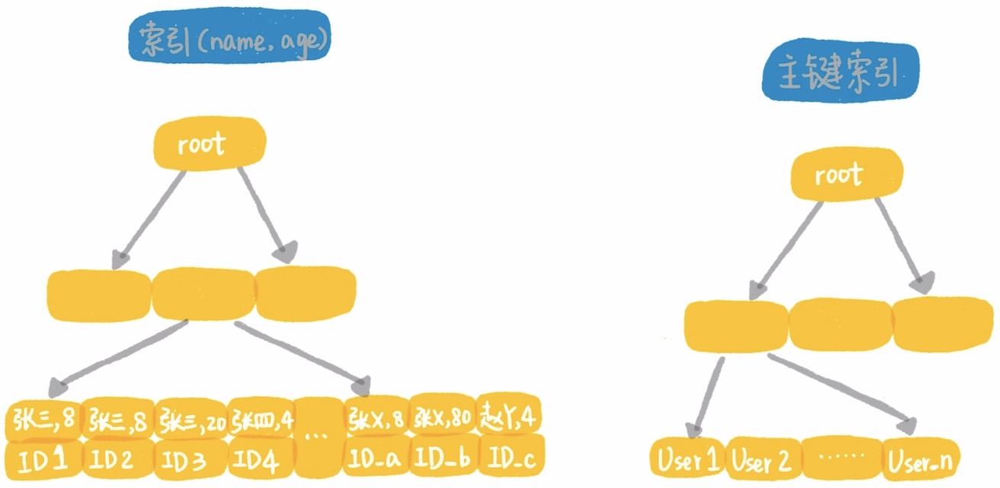

查询优化并不是简简单单看有没有使用索引，看的扫描表的行数和执行sql的时间

在某些情况下使用了索引查询的速度也不一定快

每个表有默认的主键，就默认有主键索引

主键索引：是由ID和数据域组成的

表的其他字段作为索引：保存的是当前字段的值和主键ID的值，在根据ID查找整行数据

回表：由Id去主键索引上查找整行数据的行为。（比较浪费时间）

MySQL为什么选择B树：

CPU将磁盘上的数据加载到内存需要一定量的时间，B树成为了比较好的选择