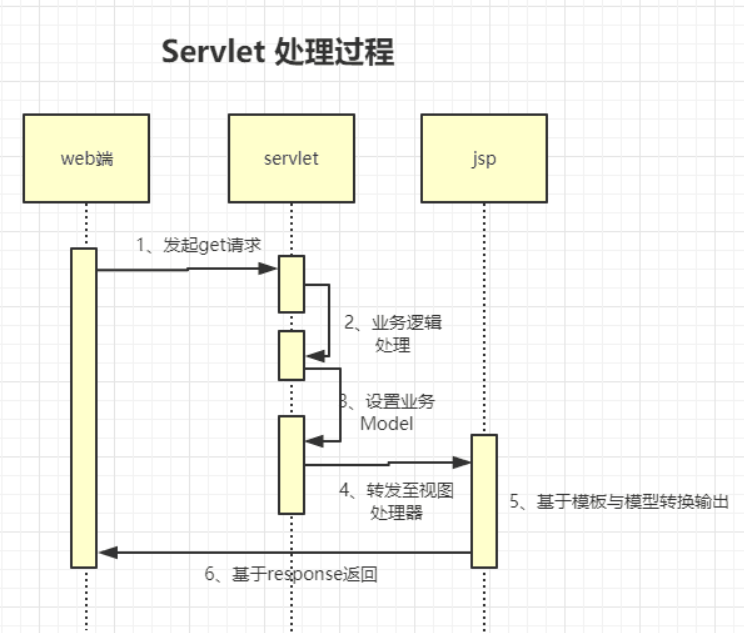
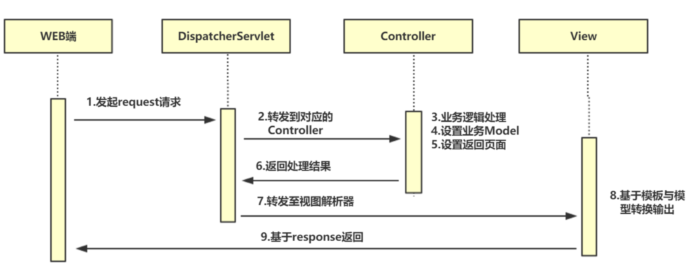
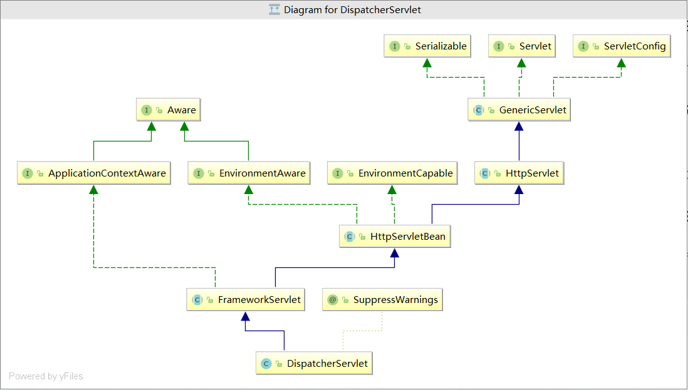
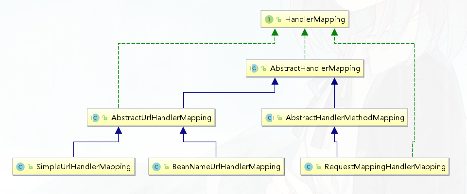
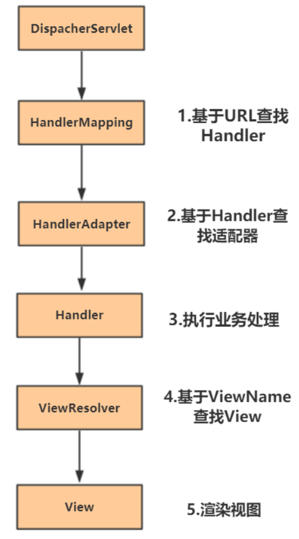
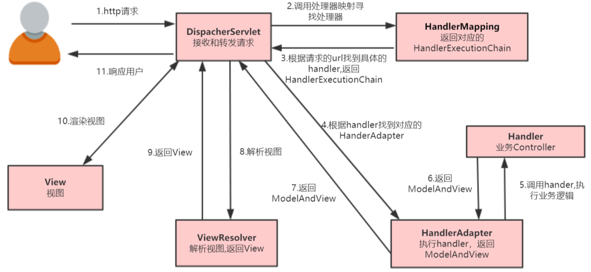
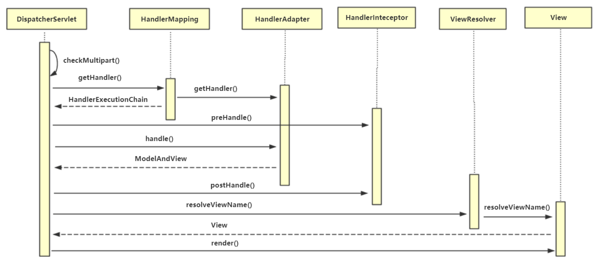

# 深入理解Spring MVC

1. Spring MVC设计思想

2.  Spring MVC各大组件详解和执行流程分析

3.  Spring MVC 零xml配置实现及其原理分析

4. Tomcat启动带动Spring IoC容器启动流程

   


## 1. Spring MVC 设计思想

### 1.1 回顾servlet 与jsp 执行过程

WEB-INF/web.xml

```xml
<servlet>
    <servlet-name>servlet</servlet-name>
    <servlet-class>bat.ke.qq.com.HelloServlet</servlet-class>
</servlet>

<servlet-mapping>
    <servlet-name>servlet</servlet-name>
    <url-pattern>/hello</url-pattern>
</servlet-mapping>
```

```java
@WebServlet("/hello") 
public class HelloServlet extends HttpServlet {

    @Override
    protected void doGet(HttpServletRequest req, HttpServletResponse resp) throws ServletException, IOException {
        resp.setContentType("text/html");
        resp.getWriter().write("<h1>hello world</h1>");
    }
}
```



### 1.2 什么是Spring MVC

Spring Web MVC是基于Servlet API构建的原始Web框架，从一开始就包含在Spring框架中。其正式名称“Spring Web MVC”来自它的源模块(Spring -webmvc)的名称，但它更常见的名称是“Spring MVC”。

 Springmvc本质上还是在使用Servlet处理，并在其基础上进行了封装简化了开发流程，提高易用性、并使用程序逻辑结构变得更清晰

- 基于注解的URL映射

- http表单参数转换

- 全局统一异常处理

- 拦截器的实现



## 2. Spring MVC应用及其源码分析

### 2.1 Spring MVC 组件介绍

#### DispatchServlet

前端控制器 

请求处理逻辑： DispatcherServlet#doDispatch  




#### HandlerMapping    

处理器映射

其为mvc 中url路径与Controller对象的映射，DispatcherServlet 就是基于此组件来寻找对应的Control，如果找不到就会报Not Found mapping 的异常。

目前主流的三种mapping 如下：

```java
BeanNameUrlHandlerMapping   //基于ioc中beanName以 "/" 开头的Bean的映射

SimpleUrlHandlerMapping  //基于手动配置 url 与controller映射

RequestMappingHandlerMapping  //基于@RequestMapping注解配置对应的映射
```



#### HandlerAdapter   

处理器适配器

Springmvc 采用适配器模式来适配调用指定Handler，根据Handler的不同种类采用不同的Adapter,其Handler与 HandlerAdapter 对应关系如下:

| **Handler类别**    | 对应适配器                     | 描述                                               |
| :----------------- | ------------------------------ | -------------------------------------------------- |
| Controller         | SimpleControllerHandlerAdapter | 标准控制器，返回ModelAndView                       |
| HttpRequestHandler | HttpRequestHandlerAdapter      | 业务自行处理 请求，不需要通过modelAndView 转到视图 |
| Servlet            | SimpleServletHandlerAdapter    | 基于标准的servlet 处理                             |
| HandlerMethod      | RequestMappingHandlerAdapter   | 基于@requestMapping对应方法处理                    |


#### HandlerExecutionChain

处理器执行链（handler  interceptors）

```java
private final Object handler;

private HandlerInterceptor[] interceptors;

private List<HandlerInterceptor> interceptorList;

```


#### ViewResolver 

视图解析器

找到应的Adapter 之后就会基于适配器调用业务处理，处理完之后业务方会返回一个ModelAndView ，在去查找对应的视图进行处理。

其在DispatcherServlet#resolveViewName() 中遍历 viewResolvers 列表查找，如果找不到就会报一个 Could not resolve view with name 异常。

```java
View resolveViewName(String viewName, Locale locale) throws Exception;
```


#### View

具体解析视图

基于ViewResolver**.**resolveViewName() 获取对应View来解析生成Html并返回

```java
void render(@Nullable Map<String, ?> model, HttpServletRequest request, HttpServletResponse response) throws Exception;
```


#### HandlerExceptionResolver 

处理器异常解析器

该组件用于指示当出现异常时 Spring mvc 该如何处理。

DispatcherServlet 会调用DispatcherServlet#processHandlerException() 方法，遍历 handlerExceptionResolvers 处理异常，处理完成之后返回errorView 跳转到异常视图。


#### HandlerInterceptor  

处理器拦截器

其实现机制是基于 HandlerExecutionChain 分别在 doDispatch 方法中执行以下方法：

- preHandle ：业务处理前执行

- postHandle：业务处理后（异常则不执行）

- afterCompletion：视图处理后


在org/springframework/web/servlet/DispatcherServlet.properties文件中配置了mvc默认的相关组件

示例： 

```xml
<!--控制器-->
<bean id="simpleConroller" class="bat.ke.qq.com.controller.SimpleController"/>

<!-- url映射器-->
<bean class="org.springframework.web.servlet.handler.SimpleUrlHandlerMapping">
    <property name="urlMap">
        <props>
            <prop key="/user.do">simpleConroller</prop>
        </props>
    </property>
    <property name="interceptors" ref="myHandlerInterceptor"></property>
</bean>

<!-- 执行适配器-->
<bean class="org.springframework.web.servlet.mvc.SimpleControllerHandlerAdapter"/>


<!--视图解析器-->
<bean class="org.springframework.web.servlet.view.InternalResourceViewResolver">
    <property name="prefix" value="WEB-INF/page/"/>
    <property name="suffix" value=".jsp"/>
    <property name="viewClass" value="org.springframework.web.servlet.view.JstlView"/>


<!--拦截器-->
<bean id="myHandlerInterceptor" class="bat.ke.qq.com.controller.MyHandlerInterceptor"/>


<!--异常处理-->
<bean class="bat.ke.qq.com.controller.MyHandlerException"/>


```

创建Handler

```java
public class SimpleController implements Controller {
    @Override
    public ModelAndView handleRequest(HttpServletRequest request, HttpServletResponse response) throws Exception {
        ModelAndView mv = new ModelAndView("user");
        mv.addObject("name","fox");

        return mv;
    }
```


### 2.2 执行流程





### 2.3 应用配置

#### xml

- web.xml 中配置DispatcherServlet

  ```xml
  <servlet>
    <servlet-name>dispatcherServlet</servlet-name>
    <servlet-class>org.springframework.web.servlet.DispatcherServlet</servlet-class>
    <init-param>
      <param-name>contextConfigLocation</param-name>
      <param-value>classpath:spring-mvc.xml</param-value>
    </init-param>
    <load-on-startup>1</load-on-startup>
  </servlet>
  
  
  <servlet-mapping>
    <servlet-name>dispatcherServlet</servlet-name>
    <url-pattern>/</url-pattern>
  </servlet-mapping>
  ```

  

- 配置spring-mvc.xml

  
  

```java
<context:component-scan base-package="bat.ke.qq.com.controller" />
<!-- 注解驱动 -->
<!--自动向ioc注册了RequestMappingHandlerMapping与BeanNameUrlHandlerAdapter-->
<mvc:annotation-driven/>

<!--拦截器-->
<mvc:interceptors>
    <bean class="bat.ke.qq.com.config.MyHandlerInterceptor"/>
</mvc:interceptors>


<!--视图解析器-->
<bean class="org.springframework.web.servlet.view.InternalResourceViewResolver">
    <property name="prefix" value="WEB-INF/page/"/>
    <property name="suffix" value=".jsp"/>
    <property name="viewClass" value="org.springframework.web.servlet.view.JstlView"/>
 </bean>


<!--消息转换器-->
<mvc:annotation-driven >
    <mvc:message-converters register-defaults="true">
        <bean class="com.alibaba.fastjson.support.spring.FastJsonHttpMessageConverter"/>
    </mvc:message-converters>
</mvc:annotation-driven>
```


### 2.3 源码分析

Spring mvc的核心，调DispatcherServlet的doDispatch 完成请求处理，响应结果。

```java
DispatcherServlet#doDispatch  
```




### 2.4 零xml配置

- 替代web.xml

spring-web-5.1.8.RELEASE.jar!/META-INF/services/javax.servlet.ServletContainerInitializer

org.springframework.web.SpringServletContainerInitializer

@HandlesTypes(WebApplicationInitializer.class)

```java
public class MyWebApplicationInitializer implements WebApplicationInitializer {


    @Override
    public void onStartup(ServletContext servletCxt) {


        // Load Spring web application configuration
        AnnotationConfigWebApplicationContext ac = new AnnotationConfigWebApplicationContext();
        ac.register(AppConfig.class);     


        // Create and register the DispatcherServlet
        DispatcherServlet servlet = new DispatcherServlet(ac);
        ServletRegistration.Dynamic registration = servletCxt.addServlet("app", servlet);
        registration.setLoadOnStartup(1);
        registration.addMapping("/app/*");
        
    }
}
        
```

- spring.xml  :  @Configuration  @Bean替代

- 替代spring-mvc.xml

  ```java
  @Configuration
  @ComponentScan(value = "com.mvc.controller")
  @EnableWebMvc
  public class AppConfig implements WebMvcConfigurer {
  
  
     @Override
     public void configureMessageConverters(List<HttpMessageConverter<?>> converters) {
        converters.add(new FastJsonHttpMessageConverter());
     }
  
  
     @Override
     public void configureViewResolvers(ViewResolverRegistry registry) {
        registry.jsp("/WEB-INF/page/",".jsp");
     }
  }
  ```

  内嵌容器
  
  引入tomcat jar
  
  ```xml
   <dependency>
              <groupId>org.apache.tomcat.embed</groupId>
              <artifactId>tomcat-embed-core</artifactId>
              <version>8.5.37</version>
          </dependency>
          <dependency>
              <groupId>org.apache.tomcat.embed</groupId>
              <artifactId>tomcat-embed-jasper</artifactId>
              <version>8.5.37</version>
          </dependency>
  ```
  
  ```java
  public static void run() throws  Exception {
  		Tomcat tomcat = new Tomcat();
  		tomcat.setPort(8088);
  		// 告诉tomcat  web项目
  		tomcat.addWebapp("/","D:\\code\\java_learn\\spring-framework\\web");
  
  		tomcat.start();
  
  		tomcat.getServer().await();
  		//Thread.currentThread().join();
  	}
  ```
  
  
  
  