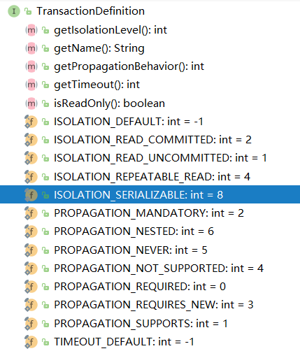
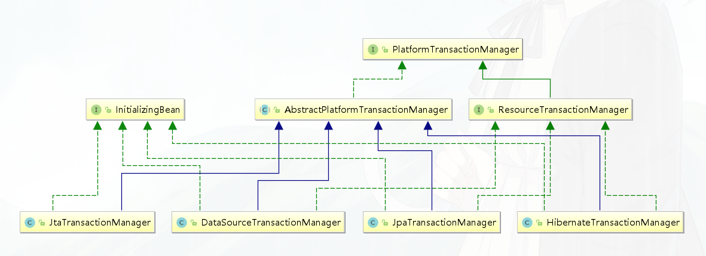

# Spring 事务原理剖析

1. 数据库事务ACID特性&事务隔离级别详解（脏读，不可重复读，幻读）
2. Spring编程式&声明式事务应用
3. 事务失效问题剖析
4. 事务传播机制详解
5. 事务源码分析


## 1. 数据库事务特性

### 1.1 ACID特性

事务（Transaction）是数据库系统中一系列操作的一个逻辑单元，==所有操作要么全部成功要么全部失败==。

事务是区分文件存储系统与Nosql数据库重要特性之一，其存在的意义是为了保证即使在并发情况下也能正确的执行crud操作。怎样才算是正确的呢？这时提出了事务需要保证的四个特性即ACID：

- **A: 原子性(atomicity)**

  ​	一个事务（transaction）中的所有操作，要么全部完成，要么全部不完成，不会结束在中间某个环节。事务在执行过程中发生错误，会被回滚（Rollback）到事务开始前的状态，就像这个事务从来没有执行过一样。

  原子性表现为==操作不能被分割==。

  

- **C: 一致性(consistency)**

  ​	在事务开始之前和事务结束以后，数据库的完整性没有被破坏。数据库要一直处于一致的状态，事务开始前是一个一致状态，事务结束后是另一个一致状态，==事务将数据库从一个一致状态转移到另一个一致状态==

  

  约束一致性：外键、Check、唯一索引

  数据一致性：由原子性、持久性、隔离性共同保证

  

- **I:  隔离性(isolation)**

  ​	数据库允许多个并发事务同时对其数据进行读写和修改的能力，==隔离性可以防止多个事务并发执行时由于交叉执行而导致数据的不一致==。事务隔离分为不同级别，包括读未提交（Read uncommitted）、读已提交（read committed）、可重复读（repeatable read）和串行化（Serializable）。

  

- **D: 持久性(durability)**

  ​	事务处理结束后，==对数据的修改就是永久的==，即便系统故障也不会丢失。


#### 扩展

##### WAL原则

==InnoDB的ARIES三原则Write Ahead Logging（WAL）==：

- 日志成功写入后事务就不会丢失，后续由checkpoint机制来保证磁盘物理文件与redo log达到一致性;
- 利用redo log来记录变更后的数据，即redo里记录事务数据变更后的值;
- 利用undo log来记录变更前的数据，即undo里记录事务数据变更前的值，用于回滚和其他事务多版本读。

##### 并发事务控制

- 单版本控制-锁

  锁用独占的方式来保证在只有一个版本的情况下事务之间相互隔离。

  在 MySQL 事务中，锁的实现与隔离级别有关系，在 RR（Repeatable Read）隔离级别下，MySQL 为了解决幻读的问题，以牺牲并行度为代价，通过 Gap 锁来防止数据的写入，而这种锁，因为其并行度不够，冲突很多，经常会引起死锁。现在流行的 Row 模式可以避免很多冲突甚至死锁问题，所以推荐默认使用 Row + RC（Read Committed）模式的隔离级别，可以很大程度上提高数据库的读写并行度。

- 多版本控制-MVCC

  在数据库中，为了实现高并发的数据访问，对数据进行多版本处理，并通过事务的可见性来保证事务能看到自己应该看到的数据版本。==MVCC 最大的好处是读不加锁，读写不冲突。==

  每一次对数据库的修改，都会在 Undo 日志中记录当前修改记录的事务号及修改前数据状态的存储地址（即 ROLL_PTR），以便在必要的时候可以回滚到老的数据版本。例如，一个读事务查询到当前记录，而最新的事务还未提交，根据原子性，读事务看不到最新数据。


### 1.2 事务隔离级别

在高并发的情况下，要完全保证其ACID特性是非常困难的，除非把所有的事务串行化执行，但带来的负面的影响将是性能大打折扣。很多时候我们有些业务对事务的要求是不一样的，所以数据库中设计了四种隔离级别，供用户基于业务进行选择。

**数据库默认隔离级别：**

Oracle中默认级别是 Read committed

mysql 中默认级别 Repeatable read

```sql
#查看mysql 的默认隔离级别
SELECT @@tx_isolation

#设置为读未提交
set tx_isolation='read-uncommitted';  

#设置为读已提交
set tx_isolation='read-committed';  

#设置为可重复读
set tx_isolation='REPEATABLE-READ';   

#设置为串行化
set tx_isolation='SERIALIZABLE';
```


- **脏读**

一个事务读取到另一事务未提交的更新数据

session_1

```sql
#设置为读未提交
set tx_isolation='read-uncommitted';  

BEGIN;

insert INTO `account` (accountName,user,money) VALUES ('222','cat',1000);

rollback;

commit;
```

session_2

```sql
#设置为读未提交
set tx_isolation='read-uncommitted';  

SELECT * from account;
```


- **不可重复读** 

 在同一事务中,多次读取同一数据返回的结果有所不同, 换句话说, 后续读取可以读到另一事务已提交的更新数据. 相反, “可重复读”在同一事务中多次读取数据时, 能够保证所读数据一样, 也就是后续读取不能读到另一事务已提交的更新数据。

事务B修改数据导致当前事务A前后读取数据不一致 ，侧重点在于事务B的修改

当前事务读到了其他事务修改的数据

session_1

```sql
#设置为读已提交
set tx_isolation='read-committed';  

BEGIN;

SELECT * from `account`;

# 其他操作

SELECT * from `account`;

commit;
```

session_2

```sql
#设置为读已提交
set tx_isolation='read-committed';  

UPDATE account SET money= money+1 where user='cat';
```


- **幻读**  

查询表中一条数据如果不存在就插入一条，并发的时候却发现，里面居然有两条相同的数据。

事务A修改表中数据，此时事务B插入一条新数据，事务A查询发现表中还有没修改的数据，像是出现幻觉

事务A读到了事务B新增的数据，导致结果不一致， 侧重点在于事务B新增数据


session_1

```sql
#设置为可重复读
set tx_isolation='REPEATABLE-READ'; 

BEGIN;

SELECT * FROM `account` WHERE `user` = 'cat';

#此时，另一个事务插入了数据

SELECT * FROM `account` WHERE `user` = 'cat';

insert INTO `account` (accountName,user,money) VALUES ('222','cat',1000);

SELECT * FROM `account` WHERE `user` = 'cat';

update `account` set money=money+10 where `user` = 'cat' ;

SELECT * FROM `account` WHERE `user` = 'cat';

commit;
```

session_2

```sql
#设置为可重复读
set tx_isolation='REPEATABLE-READ';

insert INTO `account` (accountName,user,money) VALUES ('222','cat',1000);

```


## 2. Spring 事务应用及源码分析

### 2.1 Spring 事务相关API

Spring 事务是在数据库事务的基础上进行封装扩展 其主要特性如下：

- 支持原有的数据库事务的隔离级别，加入了==事务传播==的概念 
- 提供多个事务的合并或隔离的功能
- 提供声明式事务，让业务代码与事务分离，事务变得更易用  （AOP） 

Spring 提供了事务相关接口：

#### TransactionDefinition 

事务定义 ：  事务的隔离级别  事务的传播行为



#### TransactionAttribute

事务属性，实现了对回滚规则的扩展(处理异常)

```java
boolean rollbackOn(Throwable ex);
```


#### PlatformTransactionManager

事务管理器

```java
public interface PlatformTransactionManager {

    TransactionStatus getTransaction(TransactionDefinition definition) throws TransactionException;

    void commit(TransactionStatus status) throws TransactionException;

    void rollback(TransactionStatus status) throws TransactionException;
}
```



#### TransactionStatus

事务运行时状态

```java
public interface TransactionStatus extends SavepointManager {

    boolean isNewTransaction();

    boolean hasSavepoint();

    void setRollbackOnly();

    boolean isRollbackOnly();

    void flush();

    boolean isCompleted();

}
```


相关的实现类： 

#### TransactionInterceptor

事务拦截器，实现了MethodInterceptor


#### TransactionAspectSupport

事务切面支持, 内部类TransactionInfo封装了事务相关属性

**TransactionAspectSupport.TransactionInfo**

```java
protected final class TransactionInfo {
    @Nullable
    private final PlatformTransactionManager transactionManager;

    @Nullable
    private final TransactionAttribute transactionAttribute;

    private final String joinpointIdentification;

    @Nullable
    private TransactionStatus transactionStatus;

    @Nullable
    private TransactionInfo oldTransactionInfo;
```


### 2.2 编程式事务

```java
public class SpringTransactionExample {
    private static String url = "jdbc:mysql://127.0.0.1:3306/test";
    private static String user = "root";
    private static String password = "root";


    public static void main(String[] args) {

        // 获取数据源
        final DataSource ds = new DriverManagerDataSource(url, user, password);
        // 编程式事务
        final TransactionTemplate template = new TransactionTemplate();
        // 设置事务管理器
        template.setTransactionManager(new DataSourceTransactionManager(ds));

        template.execute(new TransactionCallback<Object>() {
            @Override
            public Object doInTransaction(TransactionStatus status) {
                Connection conn = DataSourceUtils.getConnection(ds);
                Object savePoint = null;
                try {
                    {
                        // 插入
                        PreparedStatement prepare = conn.
                                prepareStatement(
                                "insert INTO account (accountName,user,money) VALUES (?,?,?)");
                        prepare.setString(1, "111");
                        prepare.setString(2, "aaa");
                        prepare.setInt(3, 10000);
                        prepare.executeUpdate();
                    }
                    // 设置保存点
                   savePoint = status.createSavepoint();
                    {
                        // 插入
                        PreparedStatement prepare = conn.
                                prepareStatement(
                                "insert INTO account (accountName,user,money) VALUES (?,?,?)");
                        prepare.setString(1, "222");
                        prepare.setString(2, "bbb");
                        prepare.setInt(3, 10000);
                        prepare.executeUpdate();
                    }
                    {
                        // 更新
                        PreparedStatement prepare = conn.prepareStatement(
                                "UPDATE account SET money= money+100 where user=?");
                        prepare.setString(1, "aaa");
                        prepare.executeUpdate();
                        //int i=1/0;

                    }
                } catch (SQLException e) {
                    e.printStackTrace();
                } catch (Exception e) {
                    System.out.println("更新失败");
                    if (savePoint != null) {
                        status.rollbackToSavepoint(savePoint);
                    } else {
                        status.setRollbackOnly();
                    }
                }
                return null;
            }
        });
    }


}
```


### 2.2 声明式事务

#### xml配置

添加tx名字空间

```xml
xmlns:tx="http://www.springframework.org/schema/tx"
```

配置事务管理器和数据源

```xml
<bean id="dataSource" class="org.springframework.jdbc.datasource.DriverManagerDataSource">
    <constructor-arg name="url" value="jdbc:mysql://127.0.0.1/test"/>
    <constructor-arg name="username" value="root"/>
    <constructor-arg name="password" value="root"/>
</bean>

<bean id="txManager" class="org.springframework.jdbc.datasource.DataSourceTransactionManager">
    <property name="dataSource" ref="dataSource"/>
</bean>
```

事务切面配置

```xml
<!-- 事物切面配置 -->  
<tx:advice id="advice" transaction-manager="txManager">
    <tx:attributes>
        <tx:method name="update*" propagation="REQUIRED" read-only="false" rollback-for="java.lang.Exception"/>
        <tx:method name="add*" propagation="REQUIRED" read-only="false"/>
    </tx:attributes>
</tx:advice>
```

```xml
<!-- 事物切入点 -->
<aop:config>
    <aop:pointcut expression="execution(* bat.ke.qq.com.service.*.*(..))" id="txPointCut"/>
    <aop:advisor advice-ref="advice" pointcut-ref="txPointCut"/>
</aop:config>
```


#### @Transactional

```xml
<!-- 开启事务控制的注解支持 -->  
<tx:annotation-driven transaction-manager="txManager"/>
```

事务注解配置，作用于类，方法上

| 属性名           | 说明                                                         |
| :--------------- | :----------------------------------------------------------- |
| name             | 当在配置文件中有多个 TransactionManager , 可以用该属性指定选择哪个事务管理器。 |
| propagation      | 事务的传播行为，默认值为 REQUIRED。                          |
| isolation        | 事务的隔离度，默认值采用 DEFAULT。                           |
| timeout          | 事务的超时时间，默认值为-1。如果超过该时间限制但事务还没有完成，则自动回滚事务。 |
| read-only        | 指定事务是否为只读事务，默认值为 false；为了忽略那些不需要事务的方法，比如读取数据，可以设置 read-only 为 true。 |
| rollback-for     | 用于指定能够触发事务回滚的异常类型，如果有多个异常类型需要指定，各类型之间可以通过逗号分隔。 |
| no-rollback- for | 抛出 no-rollback-for 指定的异常类型，不回滚事务。            |


#### Java Configuration

**@EnableTransactionManagement**

利用TransactionManagementConfigurationSelector向容器中注册两个组件

* AutoProxyRegistrar  

  给容器中注册一个 InfrastructureAdvisorAutoProxyCreator 的后置处理器，返回一个代理对象（增强器），代理对象执行方法利用拦截器链进行调用；

* ProxyTransactionManagementConfiguration   是一个@Configuration

  *        给容器中注册事务增强器transactionAdvisor；
  *           AnnotationTransactionAttributeSource解析事务注解
  *           事务拦截器transactionInterceptor

```java
@Configuration
@ComponentScan("bat.ke.qq.com")
@EnableTransactionManagement
@EnableAspectJAutoProxy(proxyTargetClass = true)
public class AppConfig {

    @Bean
    public DataSource dataSource(){
        DriverManagerDataSource dataSource = new DriverManagerDataSource();
        dataSource.setDriverClassName("com.mysql.jdbc.Driver");
        dataSource.setUrl("jdbc:mysql://localhost:3306/test?characterEncoding=utf8");
        dataSource.setUsername("root");
        dataSource.setPassword("root");
        return dataSource;
    }

    @Bean
    public JdbcTemplate jdbcTemplate(DataSource dataSource) {
        return new JdbcTemplate(dataSource);
    }

    @Bean
    public PlatformTransactionManager transactionManager(DataSource dataSource) {
        return new DataSourceTransactionManager(dataSource);
    }
}

```


### 2.3 事务失效问题

- Bean是否是代理对象

- 入口函数是否是public的

- 数据库是否支持事务(Mysql的MyIsam不支持事务) ，行锁才支持事务

- 切点是否配置正确

- 内部方法间调用导致事务失效

  因为this不是代理对象，可以配置 expose-proxy="true" ，就可以通过AopContext.currentProxy()获取

  到当前类的代理对象。

  ```xml
  <!-- expose-proxy="true" 类内部可以获取到当前类的代理对象 -->
  <aop:aspectj-autoproxy expose-proxy="true"/>
  ```

  ```java
  @EnableAspectJAutoProxy(exposeProxy = true)
  ```

  也可以注入当前bean

- ==异常类型是否配置正确==   

  默认只支持 RuntimeException和Error ，不支持检查异常

  想要支持检查异常需配置rollbackFor

  ```java
  @Transactional(rollbackFor = Exception.class)
  ```
  
  
  
  异常体系：


源码分析

```java
#找事务拦截器
TransactionInterceptor#invoke
# 事务相关的调用
TransactionAspectSupport#invokeWithinTransaction
#异常回滚的逻辑
TransactionAspectSupport#completeTransactionAfterThrowing

#异常回滚
txInfo.transactionAttribute.rollbackOn(ex)

#可以设置异常回滚规则  
RuleBasedTransactionAttribute#rollbackOn

# 默认的异常回滚规则
DefaultTransactionAttribute#rollbackOn
public boolean rollbackOn(Throwable ex) {
	return (ex instanceof RuntimeException || ex instanceof Error);
}
```


### 2.4 事务传播机制

#### 传播属性


**常用事务传播机制：**

- **PROPAGATION_REQUIRED**

  这个也是默认的传播机制；

  

- **PROPAGATION_REQUIRES_NEW**

  总是新启一个事务，这个传播机制适用于不受父方法事务影响的操作，比如某些业务场景下需要记录业务日志，用于异步反查，那么不管主体业务逻辑是否完成，日志都需要记录下来，不能因为主体业务逻辑报错而丢失日志；

  

- **PROPAGATION_NOT_SUPPORTED**

  可以用于发送提示消息，站内信、短信、邮件提示等。不属于并且不应当影响主体业务逻辑，即使发送失败也不应该对主体业务逻辑回滚。


#### 源码分析

```java
#找事务拦截器
TransactionInterceptor#invoke
# 事务相关的调用
>TransactionAspectSupport#invokeWithinTransaction

#返回事务信息 TransactionInfo
>TransactionAspectSupport#createTransactionIfNecessary

# 返回 TransactionStatus  包含事务传播属性的逻辑
>AbstractPlatformTransactionManager#getTransaction

```


Spring 事务源码剖析： https://www.processon.com/view/link/5d1a1267e4b00218c00e21ac