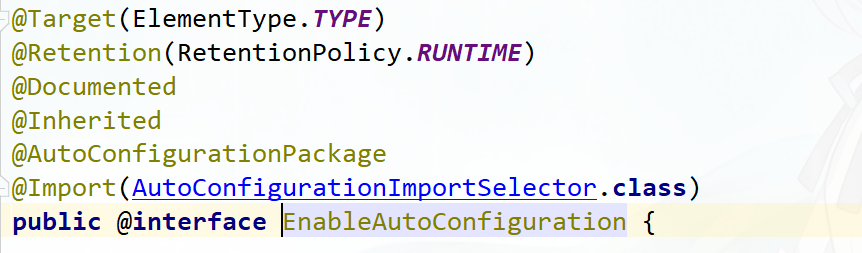

# SpringBoot自动配置和启动流程源码分析

主讲老师：源码学院fox老师

课程内容：

1. 自动配置源码分析，@SpringBootApplication详解
2. Spring是如何注册AutoConfiguration类的
3. Spring Boot启动流程源码分析
4. Spring Boot是如何判断容器类型的，是如何启动Spring 容器的


### 自动配置源码分析

自动配置 @SpringBootApplication：

https://www.processon.com/view/link/5e68da9de4b055496ae31994

自动配置如何注册AutoConfiguration：

https://www.processon.com/view/link/5e577bfce4b0362765068206

**@SpringBootApplication**



**@Inherited**

JAVA自带的注解，使用此注解声明出来的自定义注解，在使用此自定义注解时，如果注解在类上面时，子类会自动继承此注解，否则的话，子类不会继承此注解。

**@SpringBootConfiguration**

Spring自定义注解，标记这是一个 Spring Boot 配置类


**@ComponentScan**

Spring 自定义的注解，扫描指定路径下的 Component

- basePackages：指定扫描的包，basePackageClasses：指定扫描的类
- useDefaultFilters：取消默认filter设置，默认Filter自动扫描包下的Component，取消相当于禁用某个扫描
- @ComponentScan.Filter：指定Filter 规则，可用于excludeFilters 排除Filters ，includeFilters 包含Filters

**@EnableAutoConfiguration**

Spring Boot 自定义的注解，用于开启自动配置功能，是 spring-boot-autoconfigure 项目最核心的注解。


- **@AutoConfigurationPackage** 注解，将启动类所在的package作为自动配置的package ，会向容器注册beanName为org.springframework.boot.autoconfigure.AutoConfigurationPackages的bean。
- **@Import** 注解，可用于资源的导入
- **AutoConfigurationImportSelector** ，导入自动配置相关的资源

**AutoConfigurationImportSelector**

```java
protected List<String> getCandidateConfigurations(AnnotationMetadata metadata,
      AnnotationAttributes attributes) {
 //加载指定类型 EnableAutoConfiguration 对应的，在 `META-INF/spring.factories` 里的配置类
 // SpringFactoriesLoaderFactoryClass: org.springframework.boot.autoconfigure.EnableAutoConfiguration
   List<String> configurations = SpringFactoriesLoader.loadFactoryNames(
         getSpringFactoriesLoaderFactoryClass(), getBeanClassLoader());
   Assert.notEmpty(configurations,
         "No auto configuration classes found in META-INF/spring.factories. If you "
               + "are using a custom packaging, make sure that file is correct.");
   return configurations;
}
```

```java
protected AutoConfigurationEntry getAutoConfigurationEntry(
      AutoConfigurationMetadata autoConfigurationMetadata,
      AnnotationMetadata annotationMetadata) {
   //是否开启自动配置  spring.boot.enableautoconfiguration 默认开启       
   if (!isEnabled(annotationMetadata)) {
      return EMPTY_ENTRY;
   }
   // 返回@EnableAutoConfiguration 注解的属性 exclude和excludeName
   AnnotationAttributes attributes = getAttributes(annotationMetadata);
   List<String> configurations = getCandidateConfigurations(annotationMetadata,
         attributes);
   // 移除重复的配置类      
   configurations = removeDuplicates(configurations);
   //获得需要排除的配置类
   //注解上的exclude和excludeName 以及 spring.autoconfigure.exclude
   Set<String> exclusions = getExclusions(annotationMetadata, attributes);
   checkExcludedClasses(configurations, exclusions);
   // 从 configurations 中，移除需要排除的配置类
   configurations.removeAll(exclusions);
   // 根据条件（Condition），过滤掉不符合条件的配置类
   // AutoConfigurationImportFilter   Auto Configuration Import Filters
   configurations = filter(configurations, autoConfigurationMetadata);
   // 触发自动配置类引入完成的事件
   // AutoConfigurationImportListener   Auto Configuration Import Listeners
   fireAutoConfigurationImportEvents(configurations, exclusions);
   return new AutoConfigurationEntry(configurations, exclusions);
}
```


### 启动流程源码分析

Spring Boot启动流程源码分析

https://www.processon.com/view/link/5e68ffb5e4b07fc7a6828b4a

