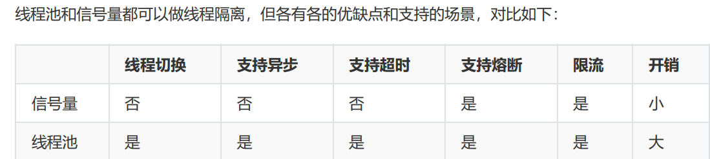

1.Hystrix（底层实现RX java线程池或者信号量）

遇到异常或一般走fallback逻辑或者走缓存（同一资源），资源隔离也是降级的一种

**Hystrix降级分为**：

- 熔断（比较严重）
- 资源隔离（线程池和信号量）
- 限流（走fallback逻辑）

2.

**Hystrix中的熔断器**
Circuit Breaker，Hystrix在运行过程中会向每个commandKey对应的熔断器报告成功、失败、超时和拒绝的状态，熔断器维护并统计这些数据，并根据这些统计信息来决策熔断开关是否打开。如果打开，熔断后续请求，快速返回。隔一段时间（**默认是5s**）之后熔断器尝试半开，放入一部分流量请求进来，相当于对依赖服务进行一次健康检查，如果请求成功，熔断器关闭  

**3.熔断的原理及恢复**

服务的健康状况=请求失败数/请求总数

**熔断器的开关由关闭到打开的状态转换是通过当前服务健康状况和设定阈值比较决定的**  

- 熔断器开关打开，请求被禁止通过
- 当熔断器器开关关闭时, 请求被允许通过熔断器器. 如果当前健康状况高于设定阈值, 开关打开. 如果当前健康状况低于设定阈值, 开关则切换为关闭状态  
- 当熔断器器开关处于打开状态, 经过一段时间后, 熔断器会自动进入半开状态, 这时熔断器只允许一个请求通过. 当该请求调用成功时, 熔断器恢复到关闭状态. 若该请求失败, 熔断器继续保持打开状态, 接下来的请求被禁⽌通过.
- 熔断器器的开关能保证服务调用者在调用异常服务时, 快速返回结果, 避免大量的同步等待. 并且熔断器器能在一段时间后继续侦测请求执行结果, 提供恢复服务调用的可能  （恢复）

**4.熔断器的配置**

Circuit Breaker主要包括如下6个参数：

- circuitBreaker.enabled
  是否启用熔断器，默认是TRUE。
- circuitBreaker.forceOpen
  熔断器强制打开，始终保持打开状态，不关注熔断开关的实际状态。默认值FLASE。
- circuitBreaker.forceClosed
  熔断器强制关闭，始终保持关闭状态，不关注熔断开关的实际状态。默认值FLASE。
- **circuitBreaker.errorThresholdPercentage**
  **错误率，默认值50%，例如一段时间（10s）内有100个请求，其中有54个超时或者异常，那么这段时**
  **间内的错误率是54%，大于了默认值50%，这种情况下会触发熔断器打开。**
- **circuitBreaker.requestVolumeThreshold**
  **默认值20。含义是一段时间内至少有20个请求才进行errorThresholdPercentage计算。比如一段时间**
  **了有19个请求，且这些请求全部失败了，错误率是100%，但熔断器不会打开，总请求数不满足20。**
- circuitBreaker.sleepWindowInMilliseconds
  半开状态试探睡眠时间，默认值5000ms。如：当熔断器开启5000ms之后，会尝试放过去一部分流量
  进行试探，确定依赖服务是否恢复。  

5.Hystrix如何防止服务雪崩

通过将每个依赖服务分配独立的线程池进行资源隔离，从而避免服务雪崩

**6.资源隔离**

线程池时，发送请求的线程和执行依赖服务的线程**不是同一个**  

线程池隔离（默认使用）优点：

- 保护应用程序以免受来自依赖故障的影响，指定依赖线程池饱和不会影响应用程序的其余部分。
  当引入新客户端lib时，即使发生问题，也是在本lib中，并不会影响到其他内容。
- 当依赖从故障恢复正常时，应用程序会立即恢复正常的性能。
- 当应用程序一些配置参数错误时，线程池的运行状况会很快检测到这一点（通过增加错误，延迟，
  超时，拒绝等），同时可以通过动态属性进行实时纠正错误的参数配置。
- 如果服务的性能有变化，需要实时调整，比如增加或者减少超时时间，更改重试次数，可以通过线
  程池指标动态属性修改，而且不会影响到其他调用请求。
- 除了隔离优势外，hystrix拥有专门的线程池可提供内置的并发功能，使得可以在同步调用之上构
  建异步门面（外观模式），为异步编程提供了支持（Hystrix引入了Rxjava异步框架）。

注意：尽管线程池提供了线程隔离，我们的客户端底层代码也必须要有超时设置或响应线程中断，不能
无限制的阻塞以致线程池一直饱和  

**缺点：**

增加计算开销

每个命令的执行都在单独的线程完成，增加了排队、调度和上下文切换的开销  

**信号量隔离：**

发送请求的线程和执行依赖服务的线程**是同一个**，都是发起请求的线程

过程：  客户端需向依赖服务发起请求时，首先要获取一个信号量才能真正发起调用，由于信号量的
数量有限，当并发请求量超过信号量个数时，后续的请求都会直接拒绝，进入fallback流程  

信号量隔离主要是通过控制并发请求量，防止请求线程大面积阻塞，从而达到限流和防止雪崩的目的。  

比较：

