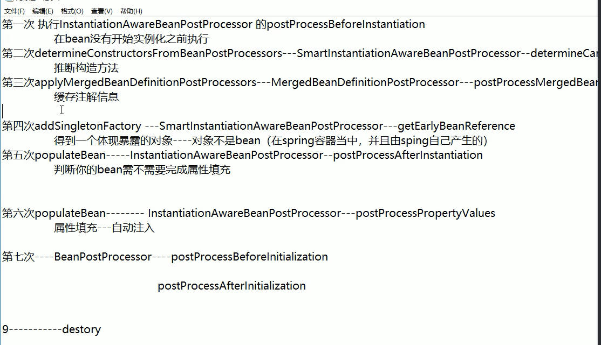

# spring的后置处理器

## 一、InstantiationAwareBeanPostProcessor

InstantiationAwareBeanPostProcessor接口继承BeanPostProcessor接口，它内部提供了3个方法，再加上BeanPostProcessor接口内部的2个方法，所以实现这个接口需要实现5个方法。InstantiationAwareBeanPostProcessor接口的主要作用在于目标对象的实例化过程中需要处理的事情，包括实例化对象的前后过程以及实例的属性设置

在org.springframework.beans.factory.support.AbstractAutowireCapableBeanFactory#createBean()方法的Object bean = resolveBeforeInstantiation(beanName, mbdToUse);方法里面执行了这个后置处理器

### 1、postProcessBeforeInstantiation

在目标对象实例化之前调用，方法的返回值类型是Object，我们可以返回任何类型的值。由于这个时候目标对象还未实例化，所以这个返回值可以用来代替原本该生成的目标对象的实例(一般都是代理对象)。如果该方法的返回值代替原本该生成的目标对象，后续只有postProcessAfterInitialization方法会调用，其它方法不再调用；否则按照正常的流程走

### 2、postProcessAfterInstantiation

方法在目标对象实例化之后调用，这个时候对象已经被实例化，但是该实例的属性还未被设置，都是null。如果该方法返回false，会忽略属性值的设置；如果返回true，会按照正常流程设置属性值。方法不管postProcessBeforeInstantiation方法的返回值是什么都会执行

### 3、postProcessPropertyValues

方法对属性值进行修改(这个时候属性值还未被设置，但是我们可以修改原本该设置进去的属性值)。如果postProcessAfterInstantiation方法返回false，该方法不会被调用。可以在该方法内对属性值进行修改

### 4、postProcessBeforeInitialization&postProcessAfterInitialization

父接口BeanPostProcessor的2个方法postProcessBeforeInitialization和postProcessAfterInitialization都是在目标对象被实例化之后，并且属性也被设置之后调用的

## 二、SmartInstantiationAwareBeanPostProcessor

智能实例化Bean后置处理器（继承InstantiationAwareBeanPostProcessor）

### 1、determineCandidateConstructors

检测Bean的构造器，可以检测出多个候选构造器

### 2、getEarlyBeanReference

循环引用的后置处理器，这个东西比较复杂， 获得提前暴露的bean引用。主要用于解决循环引用的问题，只有单例对象才会调用此方法

### 3、predictBeanType

预测bean的类型

## 三、MergedBeanDefinitionPostProcessor

### 1、postProcessMergedBeanDefinition

缓存bean的注入信息的后置处理器，仅仅是缓存或者干脆叫做查找更加合适，没有完成注入，注入是另外一个后置处理器的作用

