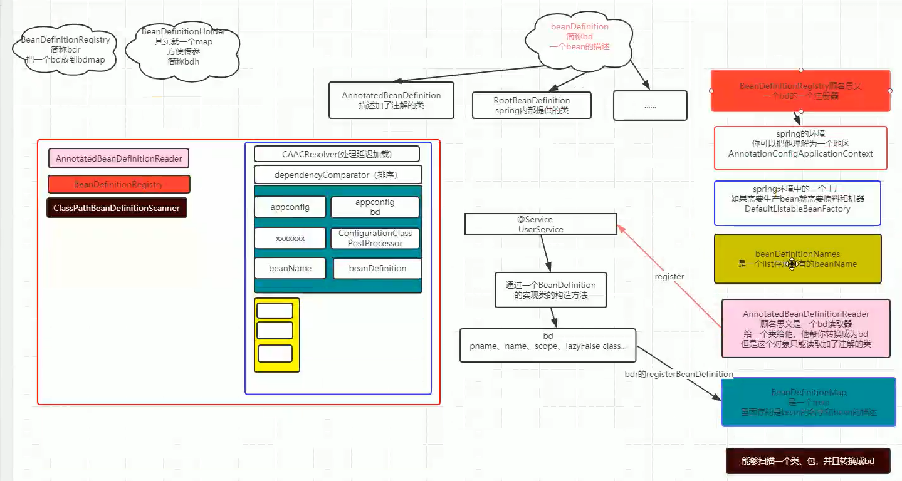

spring的注解注入：要开启注解扫描。默认情况下，spring是不开启的

spring的注入方式：构造方法注入和set方法注入

注解注入和xml注入和javaconfig注入，可以同时使用

@ImportResource("classpath:xx.xml")

IOC 控制反转，将对象交给spring容器去管理，其实IOC只是一种思想

DI:依赖注入（接口注入已经取消，set和构造方法注入）

自动装配：减少参数配置；对象更新及时（优点）

autowired按名字注入，是按照set后面的名字，这个名字

默认按byType注入(也就是类的类型，类名的驼峰写法)（优先）  可以使用注解primary   和qualifier改变

@Resource按名字注入（按属性名字）

单例引用多例的bean，多例会失效的

原因：单例只有一次机会创建，所以多列无法改变 

实现方式：applicationContextWare  或者用lookup去实现

元注解是有生命周期的（指定运行时存在）

AOP：

连接点（join point，目标对象里的方法）：一个方法就是连接点，变向来说相当于一张表的记录

point cut(切点):连接点的集合，相当于一张表

目标对象：要增强的对象，增强之后的对象就是代理对象

weaving：织入目标对象前后增强的过程

通知：Advice，织入和切点的过程

切面（Aspect）:上述的集合，一个类表示

aop(一种思想) 和spring aop（一种实现，aspectj也可以实现）

如何支持aspectj语法：Java config和xml去开启

target指的是目标对象

this指的是代理对象

继承也是可以完成代理的一种方式，重写父类方法（会产生类爆炸）

BeandeifiniationHolder保存了beanname 和beandifinitation

beanpostprocessor

