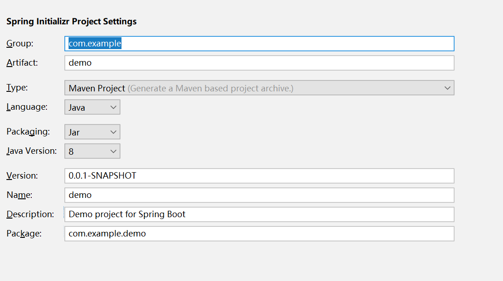
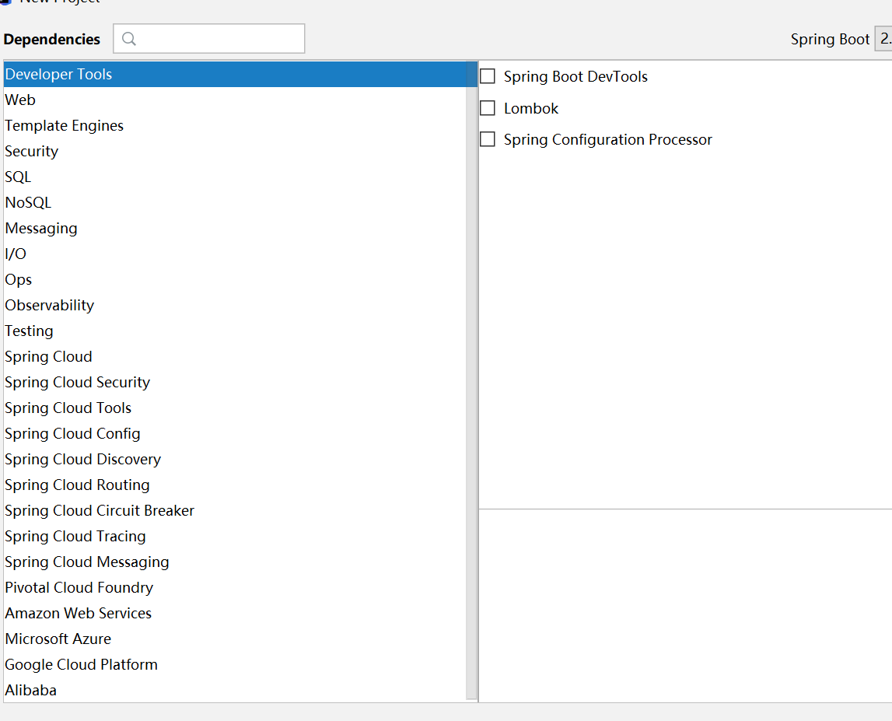
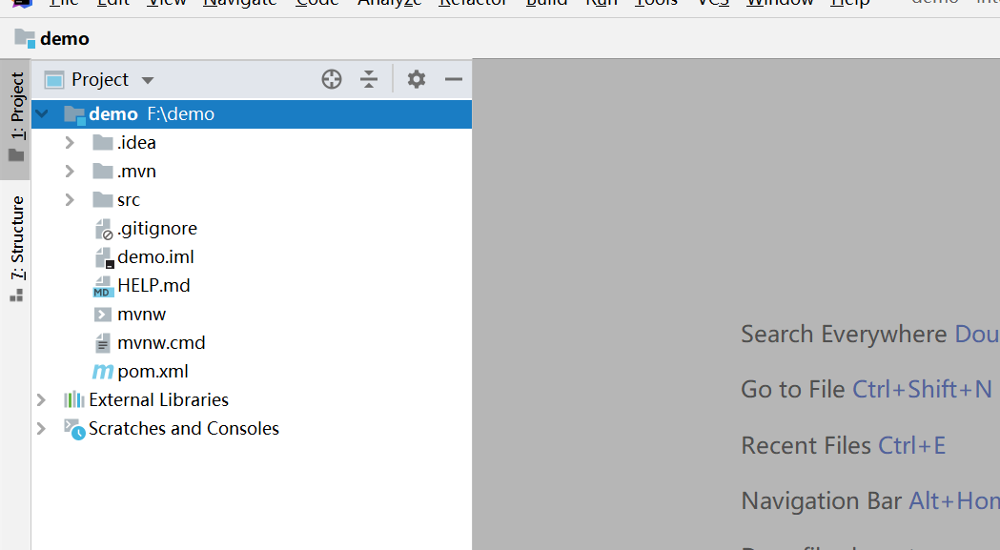
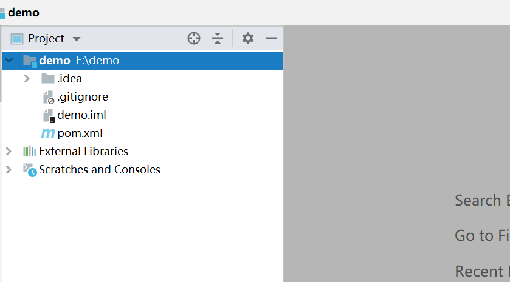

1.new project 

2.选中 Spring Initializr 

3.Next

4.

5.Next(这一步不用选)

6.

7.删除无用的.mvn目录、src目录、mvnw及mvnw.cmd文件，最终只留.gitignore和pom.xml

8.删除之后的：

9.至此父模块创建完毕

10.创建子模块

① 选择项目根目录demo右键弹出菜单，选择New -> Module

② **选择Maven，点击Next**

③ 填写ArifactId，点击Next-->finished

