javap -verbose  类的全路径 类打印详细信息（字节码，常量池）

major version 52对应的jdk是1.8.0

高版本可以兼容低版本，低版本不可以运行高版本

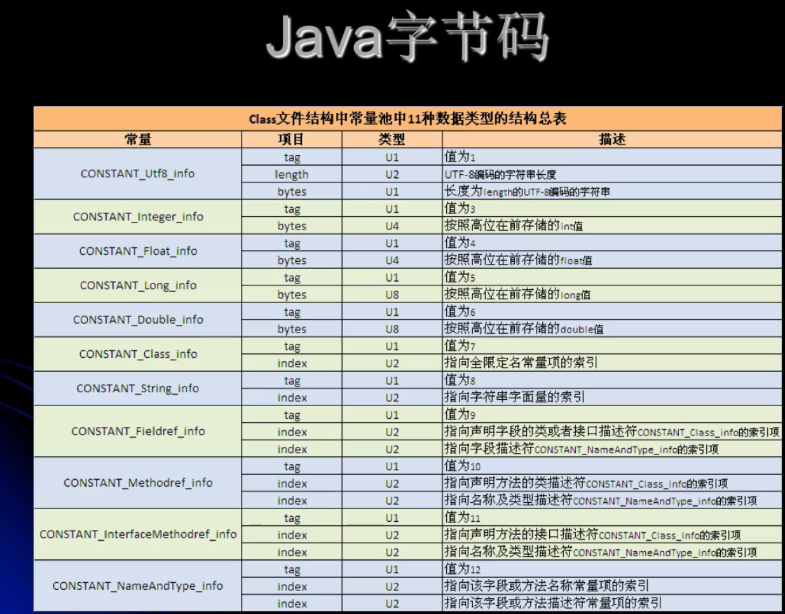

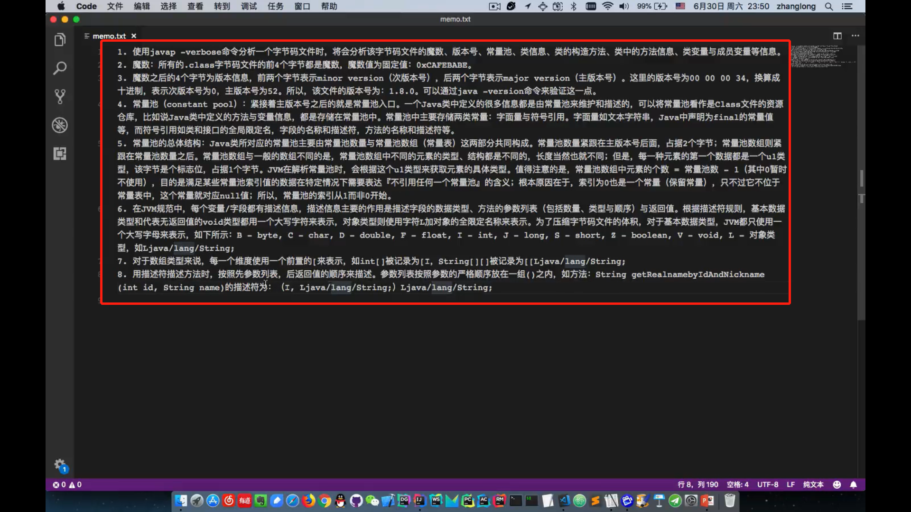

一个字节8位。2个数字就是一个字节，一个数字4位

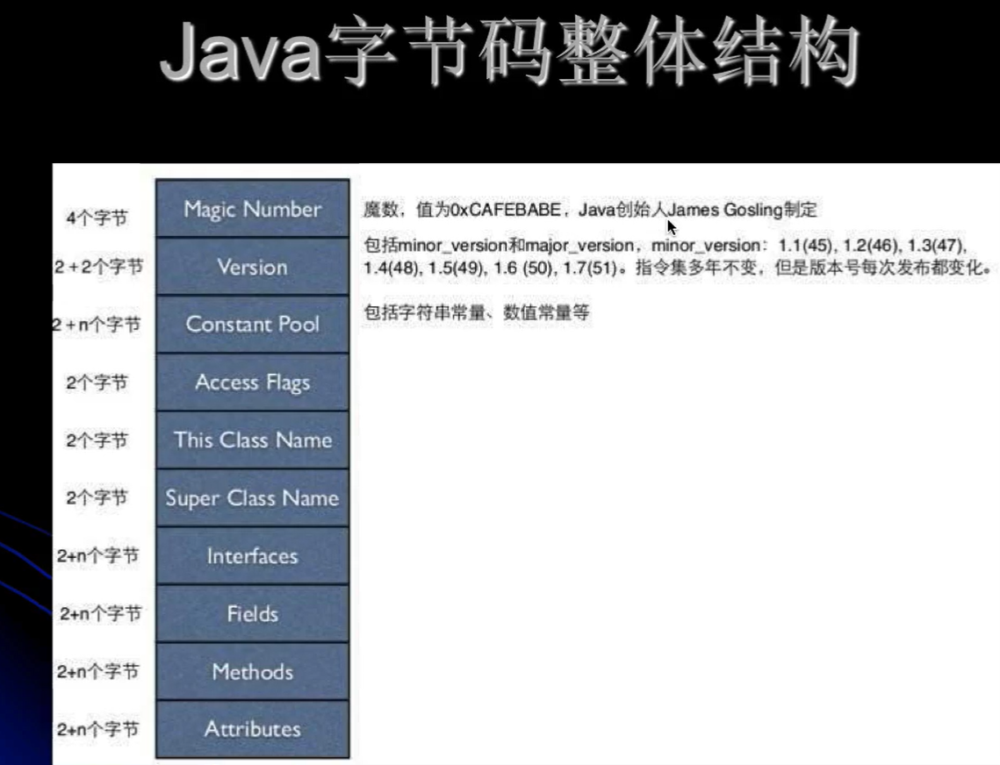

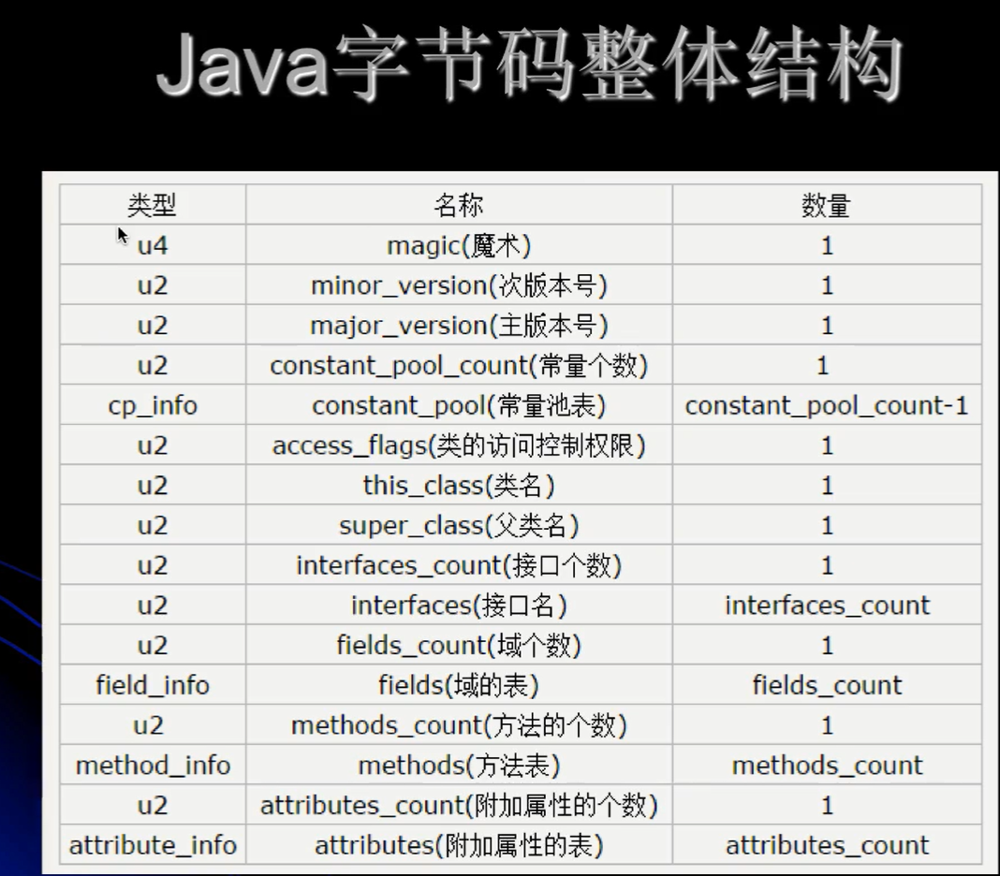

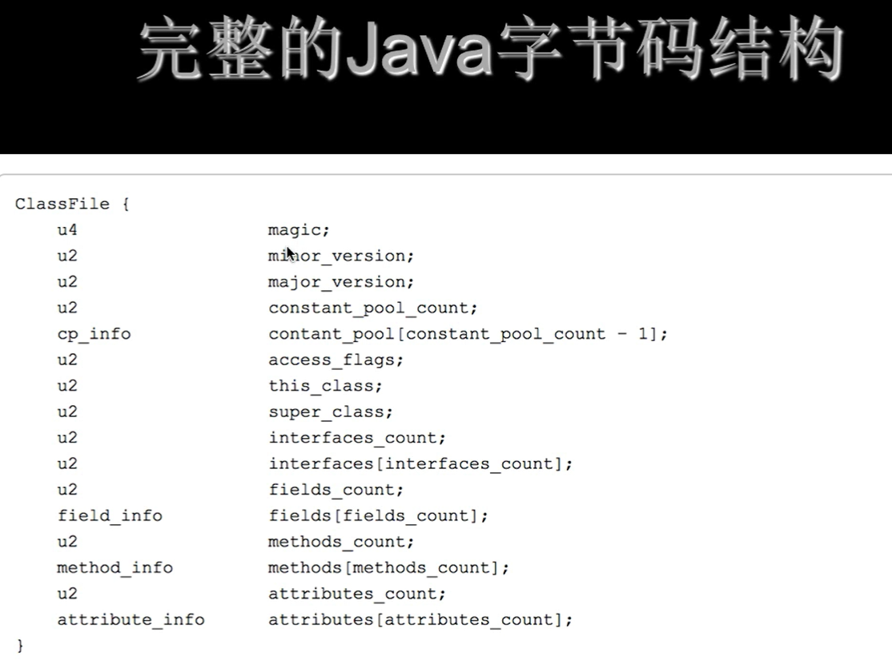

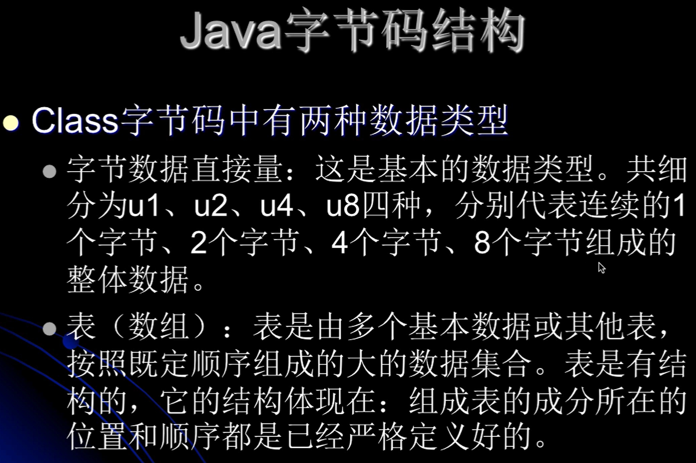

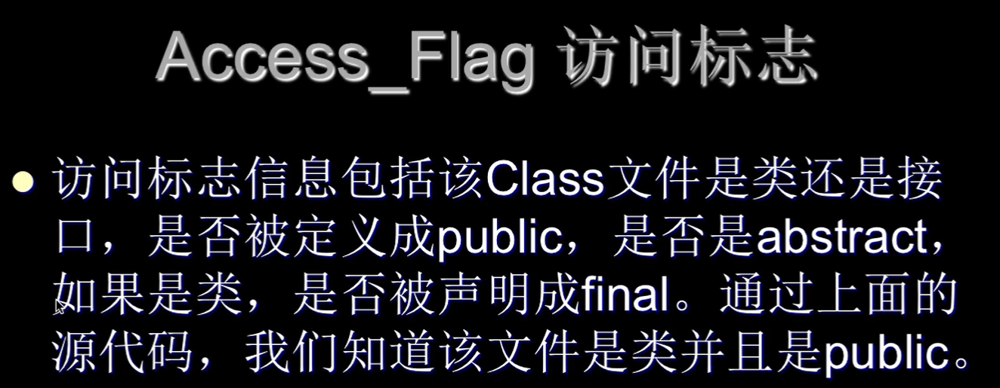

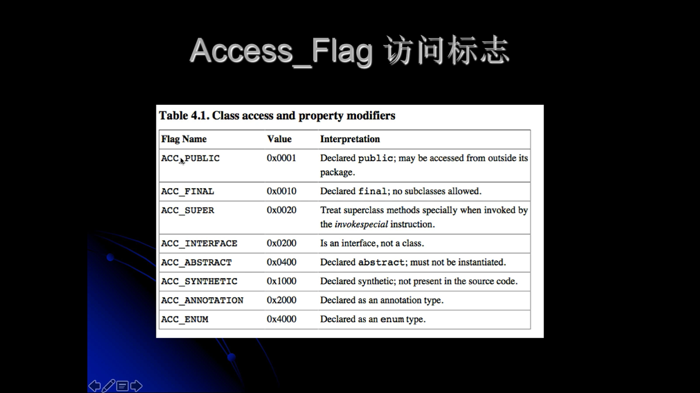

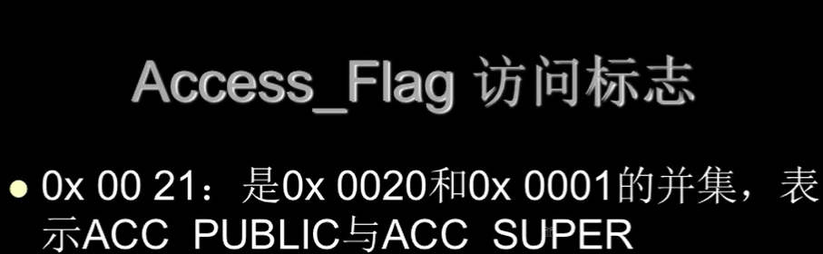

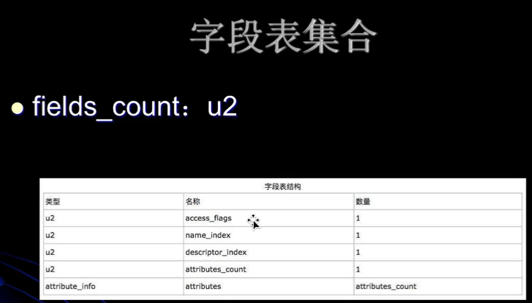

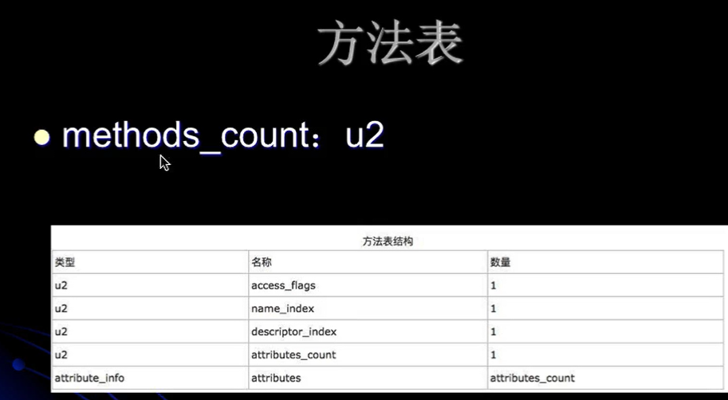

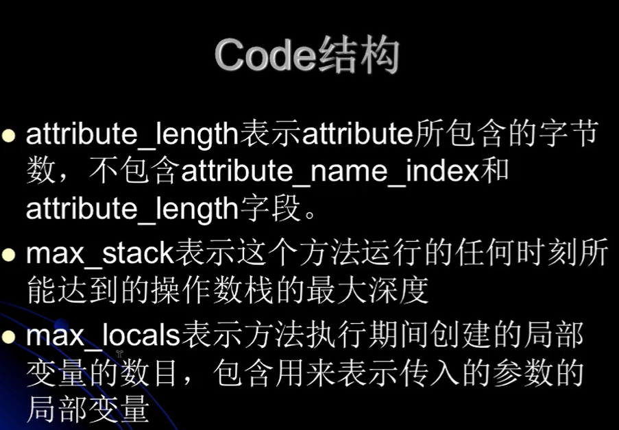

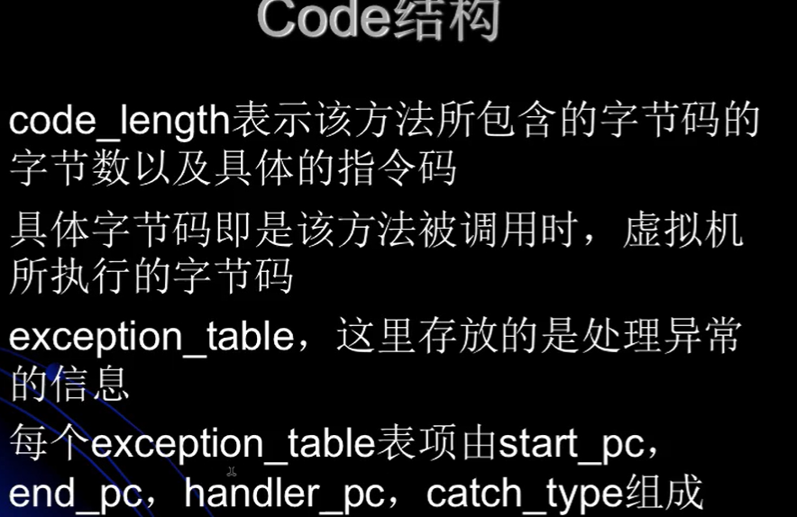

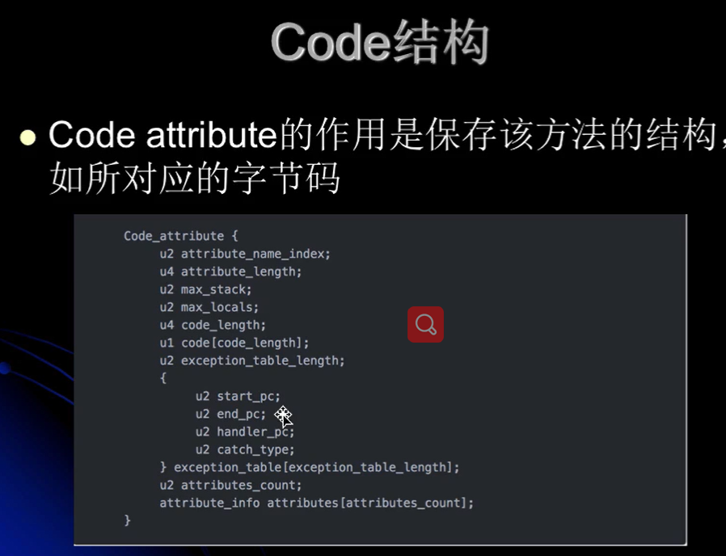

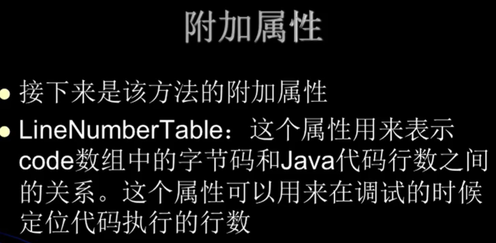

名字加描述符可以确定一个方法

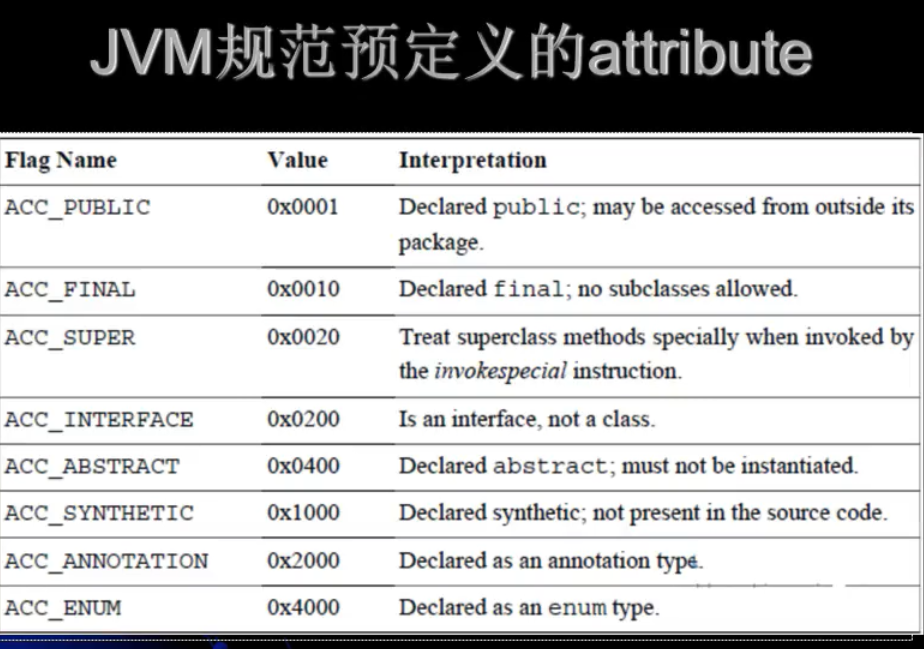

javap -verbose -p显示私有和public方法信息

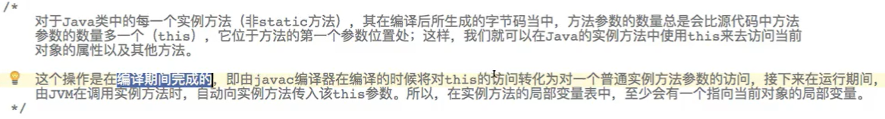

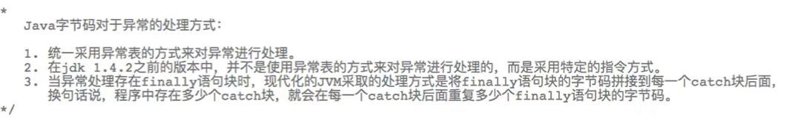

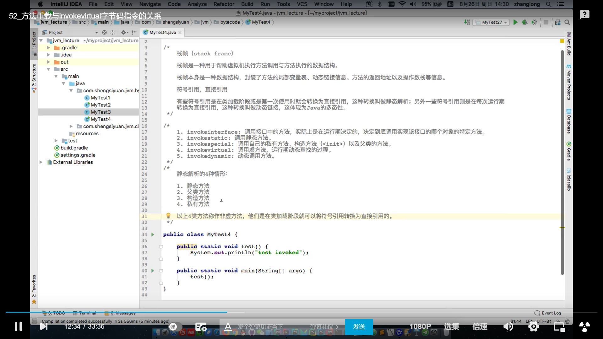

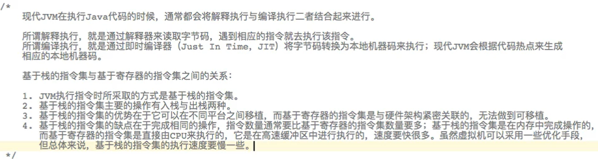