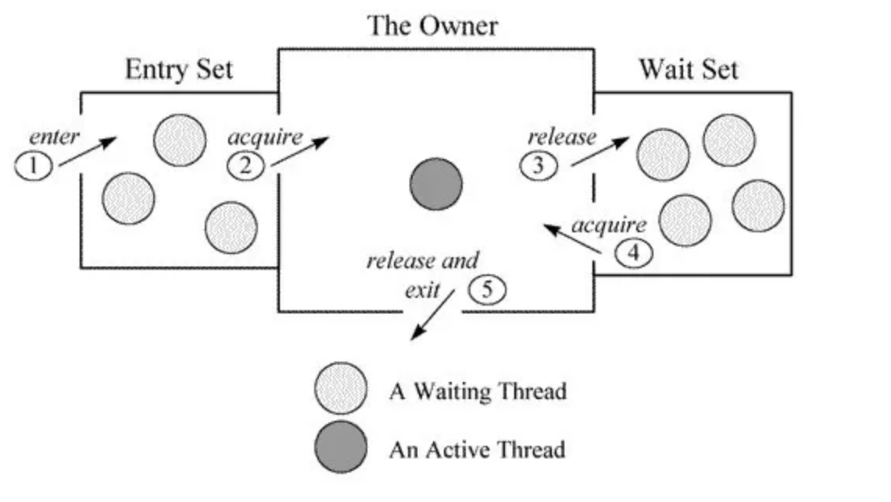

一.synchronized(**阻塞锁**)实现同步的3种方式

同步方法（锁是当前实例对象）

静态同步方法（锁是当前类的class对象）

同步方法块（锁是synchronized括号里配置的对象）

二.Monitor对象

每个对象都有一个Monitor对象相关联，Monitor对象中记录了持有锁的线程信息，等待队列等。

Monitor对象的组成：

- _owner记录当前持有锁的线程

- _EntryList是一个队列，记录所有阻塞的等待锁的线程

- _WaitSet一个队列，记录wait方法并还未通知的线程

  

过程：基于Monitor对象，当多个线程同时访问一段同步代码时，首先会进入Entry Set，当有一个线程获取到对象的锁之后，才能进行The Owner区域，其他线程还会继续在Entry Set等待。并且当某个线程调用了wait方法后，会释放锁并进入Wait Set等待。

三.Synchronized原理

JVM是基于进入和退出Monitor对象来实现方法同步和代码块同步，实现细节有所不同

- 代码块同步是使用mointorenter（在编译后插入到同步代码块的位置）和monitorexit（插入方法结束处和异常地方）指令实现的
- 方法同步是JVM会将方法社会ACC_SYNCHRONIZED标志，条用的时候JVM根据这个标志判断这个标志是不是同步方法

注意：JVM保证每个monitorenter必须有对应的monitorexit与之配对  ，通常会有2个monitorexit指令

任何对象都有一个monitor与之关联，当且一个monitor被持有后，它将处于锁定状态。
线程执行到monitorenter指令时，将会尝试获取对象所对应的monitor的所有权，即尝试获取对象的
锁  

四.Synchronized（可重入锁）

- 原子性：保证原子性，提供了两个高级的字节码指令`monitorenter`和`monitorexit`
- 可见性：对一个变量解锁之前，必须先把此变量同步回主存中。这样解锁后，后续线程就可以访问到被修改后的值，锁的是对象
- 有序性：`synchronized`是无法禁止指令重排和处理器优化的，as-if-serial保证了有序性

